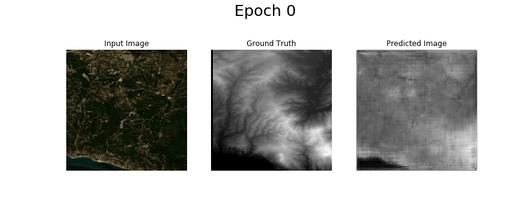
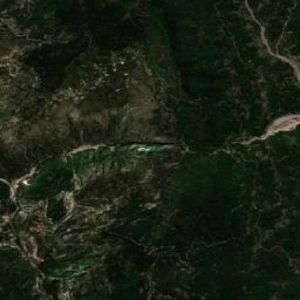

# ImageToDEM

## Predicting Surface Elevation from a single RGB satellite image

This work was presented at the 2nd workshop of RSSA, Geological Society of Greece: [[pdf](./Presentation/rssa2020-presentation.pdf)] [[odp](./Presentation/rssa2020-presentation.odp)]. We expect to release a paper on our work soon. If you find our work useful, a temporary citation could be: E. Panagiotou, G. Chochlakis, E. Charou. <i>Predicting Surface Elevation from a single RGB satellite image using cGANs</i>, in <i>Second Workshop on RSSA, Geological Society of Greece</i>, 2020.

The motivation for this project was given by the basic ingredients necessary to produce a 3D visualization of a satellite image. A Digital Elevation Model (DEM) is required to represent height, along with the satellite image itself to produce the coloration. We, instead, decided to model a system, let's call it G, to predict the elevation given a single, RGB, satellite image.

| Standard Approach | Our Approach |
|---|---|
|||

The only feasible solution to creating such a system is Artificial Intelligence and Deep Learning. We decided to model G as the Generator of a Conditional Generative Adversarial Network (cGAN).

Inspired by Isola et al., 2017, we used a U-Net for our Generator and a PatchGAN for the discriminator.

| U-Net | PatchGAN |
|---|---|
|| 

## Dataset Construction

To train the cGAN, we went ahead and created our own dataset. We used the ALOS World 3D database to get the DEMs that would serve as the groundtruth and utilized the Google Earth Engine API to couple them with the RGB satellite image (Sentinel-2)

Our python script that downloads an RGB satellite image corresponding to a DEM (or GeoJSON geometry) can be found [here](./Visualization/DEM2rgb.py).  

## Training-Results

Our implementation is in TensorFlow2.0. Our network was trained for 300 epochs, using the Adam optimizer (learning rate 2e-4, beta_1 0.5 and the rest is default) with the loss suggested by Isola et al., 2017.

The network is able to approximate the test set better and better through time:

Using [this](https://github.com/zhunor/threejs-dem-visualizer) visualizer, we were able to render out results in 3D:

| Input Image | Predicted Image | Visualization
|---|---|------|
||| 

| Input Image | Predicted Image | Visualization
|---|---|---|
||| 

## Inverse problem

Moreover, we used the same network to solve the inverse problem, i.e. predicting the RGB image given a DEM. We received promising results:

This system can be readily used, in collaboration with a simple [script](./RandomDEM/TerrainGen.py) producing DEMs based on [Perlin noise](https://en.wikipedia.org/wiki/Perlin_noise) to produce artificial terrains, fully generated without any human supervision, with application in virtual reality environments, among others. Here is an example of such a landscape:

| Input Image | Predicted Image | Visualization
|---|---|---|
| || 

---

## Restrictions

* Hardware has been scarce, therefore the dataset and the number of trials had to be limited. We expect vastly better results given enough time with a decent GPU and RAM.

* Estimations of height have been thus far relative within a single image

---

## References

* Isola, Phillip and Zhu, Jun-Yan and Zhou, Tinghui and Efros, Alexei A. Image-To-Image Translation With Conditional Adversarial Networks, in CVPR, 2017.
